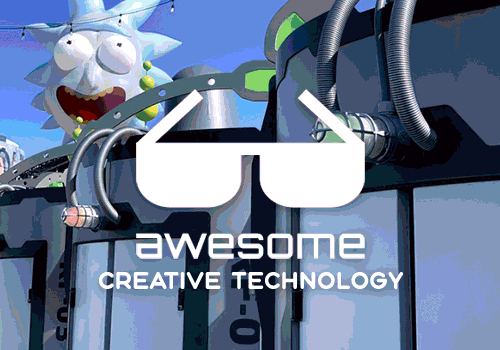

	

		
	

	 
	

		Curated list of Creative Technology groups, companies, studios, collectives, etc.
	

	 
	
	

# Awesome Creative Technology

> Businesses, groups, agencies, schools, festivals, and conferences that specialize in combining computing, design, art, and user experience.

Creative technology is a broadly interdisciplinary and transdisciplinary field combining computing, design, art, and user experience.

This list hopes to compile the best creative technology groups & resources across the world, both as a source of inspiration and as a reference point for potential employers and meetups of creative technologists.

Creative technologists by definition have a breadth of skills as opposed to a specific specialty, so it's difficult to categorize them. While this isn't a perfect organization, each group below generally specializes in the area to which they've been assigned.

---

## Table of Contents

1. [**Creative Technology**](#creative-technology)
1. [**Collectives &amp; Practices**](#collectives--practices)
1. [**Experiential Spaces &amp; Experiences**](#experiential-spaces--experiences)
1. [**Fabricators**](#fabricators)
1. [**Event Production**](#event-production)
1. [**Architecture**](#architecture)
1. [**Creative Agencies**](#creative-agencies)
1. [**Museums**](#museums)
1. [**Festivals &amp; Conferences**](#festivals--conferences)
1. [**Education**](#education)
1. [**Closed Groups**](#closed-groups)

---

## Creative Technology

| Name | Locations | Keywords | Jobs |
| ---- | --------- | -------- | ---- |
| [**1024 Architecture**](https:&#x2F;&#x2F;www.1024architecture.net&#x2F;) | [Paris] | architectural and digital works, orchestrated sound and light scores | [📧](mailto:job@1024architecture.net)
| [**17K**](https:&#x2F;&#x2F;17k.de&#x2F;) | [Stuttgart] [Berlin] | interactive experiences, digital installations, and creative technology for museums and exhibitions | 
| [**28K**](https:&#x2F;&#x2F;28k.studio&#x2F;) | [Copenhagen] [Toronto] | scandinavian digital design, branding, web, and immersive storytelling | 
| [**Acronym**](https:&#x2F;&#x2F;acronym.lol&#x2F;) | [LA] | end-to-end experience partner, strategy, narrative, creative, technology, on-the-ground execution (formerly VTProDesign) | [🌐](https:&#x2F;&#x2F;acronym.lol&#x2F;jobs)
| [**Acrylicize**](https:&#x2F;&#x2F;www.acrylicize.com&#x2F;) | [London] [NYC] [Seattle] | harness the power of art and creativity to help people fall in love with spaces | [📧](mailto:work@acrylicize.com)
| [**Ada**](https:&#x2F;&#x2F;a-da.co&#x2F;) | [NYC] | experience innovation and design agency that partners with the world&#39;s most ambitious visionaries and brands in the culture, arts and social impact space | 
| [**Adirondack Studios**](https:&#x2F;&#x2F;www.adkstudios.com&#x2F;) | [Glens Falls, NY] [Dubai] [Orlando] [Shanghai] [LA] [Singapore] | concept, schematic, design, construction, fabrication, installation, support | [🌐](https:&#x2F;&#x2F;www.adkstudios.com&#x2F;team&#x2F;#careers)
| [**Adoratorio Studio**](https:&#x2F;&#x2F;adoratorio.studio&#x2F;) | [Brescia] | digital art, interactive graphics, and web experiences | 
| [**Alt Ethos**](https:&#x2F;&#x2F;altethos.com&#x2F;) | [Denver] | experiential, metaverse, and event design agency | 
| [**Ambient Interactive**](https:&#x2F;&#x2F;www.ambientinteractive.com&#x2F;) | [Calgary, AB] | digital interactive exhibits, immersive experiences, museum technology, touch table interactives, audio-visual media, educational games | 
| [**Apache**](https:&#x2F;&#x2F;apache.co.uk) | [St Albans, UK] | virtual reality, augmented reality, body-tracking, and immersive experiential production | 
| [**Array of Stars**](https:&#x2F;&#x2F;arrayofstars.com&#x2F;) | [Toronto] | strategic design studio creating experiences across physical, digital, and spatial dimensions | 
| [**Art + Com**](https:&#x2F;&#x2F;artcom.de&#x2F;en&#x2F;) | [Berlin] | media sculptures, data installations, new media | [🌐](https:&#x2F;&#x2F;artcom.de&#x2F;en&#x2F;jobs&#x2F;)
| [**Art Processors**](https:&#x2F;&#x2F;www.artprocessors.net) | [Melbourne] [NYC] | partner with cultural and tourism organisations to invent new realities of human experience | [🌐](https:&#x2F;&#x2F;www.artprocessors.net&#x2F;job-opportunities)
| [**Artists &amp; Engineers**](https:&#x2F;&#x2F;www.artistsandengineers.co.uk&#x2F;) | [London] | production and technology studio, showrooms, concerts, art installations | 
| [**Augmented Magic**](https:&#x2F;&#x2F;www.augmented-magic.com&#x2F;) | [Paris] | augmented magic shows, digital installations | [📧](mailto:contact@augmented-magic.com)
| [**AV Controls**](https:&#x2F;&#x2F;www.av-controls.com&#x2F;) | [NYC] | site-specific technology installations, digital landmarks | [🌐](https:&#x2F;&#x2F;www.av-controls.com&#x2F;jobs-current)
| [**Baast Studio**](https:&#x2F;&#x2F;baast.studio) | [Amsterdam] | interactive experiences bridging physical and digital worlds through technology and creative innovation | 
| [**Bakken &amp; Bæck**](https:&#x2F;&#x2F;bakkenbaeck.com) | [Oslo] [Amsterdam] [London] [Bonn] [Barcelona] | design and technology studio building digital products and brands from strategy through development | [🌐](https:&#x2F;&#x2F;bakkenbaeck.com&#x2F;join)
| [**Barbarian**](https:&#x2F;&#x2F;wearebarbarian.com&#x2F;) | [NYC] | marketing and advertising, new media | [🌐](https:&#x2F;&#x2F;wearebarbarian.hire.trakstar.com&#x2F;jobs?)
| [**batwin + robin productions**](https:&#x2F;&#x2F;www.batwinandrobin.com&#x2F;) | [NYC] | environments, interactives, theaters, events | 
| [**Beaudry Interactive**](https:&#x2F;&#x2F;www.binteractive.com&#x2F;) | [LA] | themed entertainment, museum exhibitions, live shows, and branded experiences | 
| [**Belle &amp; Wissell Co**](https:&#x2F;&#x2F;bwco.info&#x2F;) | [Seattle] [WA] | media experiences, interactive exhibits, brand storytelling, design and technology studio | 
| [**Blackbow**](https:&#x2F;&#x2F;www.blackbow.cn&#x2F;) | [Beijing] | projection mapping, digital art and cultural experiences | [🌐](https:&#x2F;&#x2F;www.blackbow.cn&#x2F;career&#x2F;)
| [**Blublu**](http:&#x2F;&#x2F;www.blu-blu.com&#x2F;) | [Hangzhou] | projection mapping, immersive experiences for museums and workspace | [📧](mailto:blu@blu-blu.com)
| [**Bluecadet**](https:&#x2F;&#x2F;www.bluecadet.com&#x2F;) | [Philadelphia] [NYC] | experience design across digital and physical environments, visitor centers | [🌐](https:&#x2F;&#x2F;www.bluecadet.com&#x2F;contact&#x2F;careers&#x2F;#custom-shortcode-4)
| [**Brain**](https:&#x2F;&#x2F;brain.wtf) | [LA] | s very serious art studio | 
| [**BRC Imagination Arts**](https:&#x2F;&#x2F;www.brcweb.com&#x2F;) | [Burbank, CA] [Edinburgh] [Amsterdam] | brand and cultural stories, strategy, animation, digital and hybrid experiences | 
| [**BRDG Studios**](https:&#x2F;&#x2F;www.brdg.co&#x2F;) | [Philadelphia] | digital moments in physical spaces, retail environments, art galleries, events | [🌐](https:&#x2F;&#x2F;brdg.co&#x2F;careers&#x2F;)
| [**BREAKFAST**](https:&#x2F;&#x2F;breakfastny.com&#x2F;) | [NYC] | software-&#x2F;hardware-driven artworks, flip discs | [🌐](https:&#x2F;&#x2F;breakfaststudio.com&#x2F;jobs)
| [**Breeze Creative**](https:&#x2F;&#x2F;www.breezecreative.com&#x2F;) | [NYC] [Miami] | interactive experience design, family entertainment, museums, playgrounds, educational institutions | 
| [**Bright**](https:&#x2F;&#x2F;brig.ht&#x2F;) | [Paris] | data visualization, digital installations, experiential sites, video games | [🌐](https:&#x2F;&#x2F;brig.ht&#x2F;contact)
| [**Buoy Studio**](https:&#x2F;&#x2F;buoy.studio&#x2F;) | [LA] [NYC] [London] [Stockholm] [Sydney] | interactive digital and physical experiences across spatial design, ai, content, and gaming for brands and entertainment | 
| [**C&amp;G Partners**](https:&#x2F;&#x2F;www.cgpartnersllc.com&#x2F;) | [NYC] | branding, digital installations, exhibits and environments, signage, wayfinding, websites | [🌐](https:&#x2F;&#x2F;www.cgpartnersllc.com&#x2F;about&#x2F;careers&#x2F;)
| [**Charcoalblue**](https:&#x2F;&#x2F;www.charcoalblue.com&#x2F;) | [NYC] [Melbourne] [Chicago] [UK] [London] | amazing spaces where stories are told and experiences are shared | [🌐](https:&#x2F;&#x2F;www.charcoalblue.com&#x2F;work-with-us)
| [**Cinimod Studio**](https:&#x2F;&#x2F;www.cinimodstudio.com) | [London] | location based work where technology, environment, content and real life interaction meet | [🌐](https:&#x2F;&#x2F;www.cinimodstudio.com&#x2F;about)
| [**Cocolab**](https:&#x2F;&#x2F;cocolab.mx&#x2F;en&#x2F;) | [Mexico City] | multimedia experiences, immersive walk, exhibitions, installations, multimedia museography | 
| [**Code and Theory**](https:&#x2F;&#x2F;www.codeandtheory.com&#x2F;) | [NYC] [San Francisco] [London] [Manila] | strategically driven, digital-first agency that lives at the intersection of creativity and technology | [🌐](https:&#x2F;&#x2F;www.codeandtheory.com&#x2F;careers)
| [**Cognition**](https:&#x2F;&#x2F;cognitionlabs.io&#x2F;) | [LA] | an interactive studio designed to enrich experiences by building creative technology with human empathy | [🌐](https:&#x2F;&#x2F;www.codeandtheory.com&#x2F;careers)
| [**Collab**](https:&#x2F;&#x2F;collab.nyc&#x2F;) | [NYC] | innovation and execution studio specializing in strategy, design, fabrication, and smart environments | 
| [**Comuzi**](https:&#x2F;&#x2F;www.comuzi.xyz&#x2F;) | [London] | explore and imagine and prototyp and creatr future-forward creative concepts | 
| [**Cosm**](https:&#x2F;&#x2F;www.cosm.com&#x2F;) | [Dallas] [LA] [City] [Pittsburgh] [Gurgaon] | immersive entertainment and media, planetariums, LED domes | [🌐](https:&#x2F;&#x2F;www.cosm.com&#x2F;careers)
| [**Dada Projects**](https:&#x2F;&#x2F;dada-projects.com&#x2F;) | [London] | female-led creative studio specializing in 3D animation, CGI design, motion graphics, and immersive digital experiences | 
| [**Daily Tous Les Jours**](https:&#x2F;&#x2F;dailytouslesjours.com&#x2F;en) | [Montreal] | interactive public art and design creating collective human experiences | [🌐](https:&#x2F;&#x2F;www.dailytouslesjours.com&#x2F;en&#x2F;job-offers)
| [**DE-YAN**](https:&#x2F;&#x2F;de-yan.com&#x2F;) | [NYC] | creative concepting, experiential, motion, graphic &amp; interactive design within luxury, fashion, beauty, &amp; lifestyle | [📧](mailto:CAREERS@DE-YAN.COM)
| [**Deeplocal**](https:&#x2F;&#x2F;www.deeplocal.com&#x2F;) | [Pittsburgh] | creative engineers, inventors, interactive experiences, human stories | [🌐](https:&#x2F;&#x2F;deeplocal.applytojob.com&#x2F;)
| [**Design I&#x2F;O**](https:&#x2F;&#x2F;www.design-io.com&#x2F;) | [NYC] [San Francisco] | immersive, interactive installations, storytelling, events, galleries, museums, exhibitions and public space | 
| [**Digifun**](http:&#x2F;&#x2F;www.digitalfun.net&#x2F;) | [Shanghai] | projection mapping, new media art education | 
| [**Digital Ambiance**](https:&#x2F;&#x2F;www.digitalambiance.com&#x2F;) | [Berkeley, CA] | lighting design, projection mapping, interactive design | [🌐](https:&#x2F;&#x2F;www.digitalambiance.com&#x2F;careers&#x2F;)
| [**Digital Kitchen**](https:&#x2F;&#x2F;www.thisisdk.com) | [LA] | iconic main titles, multimedia content, imaginative experiences, and immersive spaces | 
| [**Dimensional Innovations**](https:&#x2F;&#x2F;dimin.com&#x2F;) | [Kansas City] [Atlanta] [Minneapolis] [Denver] [LA] [Pittsburgh] | experience design, interactive experiences, brand activation | [🌐](https:&#x2F;&#x2F;dimin.com&#x2F;about&#x2F;careers)
| [**Dog Studio**](https:&#x2F;&#x2F;dogstudio.co&#x2F;) | [Chicago] [Mexico City] [Amsterdam] [Namur] | multidisciplinary creative studio specializing in design, technology, and immersive brand experiences | [🌐](https:&#x2F;&#x2F;dogstudio.co&#x2F;careers&#x2F;)
| [**Dome**](http:&#x2F;&#x2F;www.domecollective.com) | [NYC] | experience design studio that gathers designers, technologists, and strategists to solve unusual problems | 
| [**Domestic Data Streamers**](https:&#x2F;&#x2F;domesticstreamers.com&#x2F;) | [Barcelona] | fighting indifference towards data | 
| [**DOTDOT**](https:&#x2F;&#x2F;dotdot.studio&#x2F;about&#x2F;) | [Auckland] [NYC] [Brisbane] | AR, music videos, interactive installations, games | 
| [**dotdotdash**](https:&#x2F;&#x2F;dotdotdash.io&#x2F;) | [Portland] [LA] [NYC] | innovation agency that seamlessly blends the physical and digital | [🌐](https:&#x2F;&#x2F;www.dotdotdash.io&#x2F;careers)
| [**Downstream**](https:&#x2F;&#x2F;downstream.com&#x2F;) | [Portland] [Amsterdam] [Melbourne] | strategy + design + content + technology | [🌐](https:&#x2F;&#x2F;downstream.com&#x2F;careers)
| [**Dpt.**](https:&#x2F;&#x2F;dpt.co&#x2F;) | [Montreal] | generating wonder with immersive platforms, AR, &amp; VR | [🌐](https:&#x2F;&#x2F;dpt.co&#x2F;en&#x2F;contact-us&#x2F;)
| [**EMMA Co-op**](https:&#x2F;&#x2F;emma.coop) | [NYC] | We develop software for clients in the video game, theater, public installation and media arts spaces among others. | 
| [**Eness**](https:&#x2F;&#x2F;www.eness.com&#x2F;) | [Melbourne] | evocative interactive experiences for public, commercial and cultural entities | [🌐](https:&#x2F;&#x2F;www.eness.com&#x2F;jobs)
| [**Envoy**](https:&#x2F;&#x2F;www.weareenvoy.com&#x2F;) | [Chicago] [LA] [San Diego] | transform environments into exceptional experiences, formerly Leviathan | [🌐](https:&#x2F;&#x2F;www.weareenvoy.com&#x2F;careers)
| [**Eos Lightmedia**](https:&#x2F;&#x2F;www.eoslightmedia.com&#x2F;) | [Vancouver] [NYC] [Orlando] | lighting and audiovisual design, themed attractions, museums, architecture, public spaces, building facades, presentation centers, and public art installations | 
| [**ESI Design**](https:&#x2F;&#x2F;esidesign.nbbj.com&#x2F;) | [NYC] | transforms places into experiences, immersive deisgn, architectural scale | [🌐](https:&#x2F;&#x2F;esidesign.nbbj.com&#x2F;jobs&#x2F;)
| [**Evidence Design**](https:&#x2F;&#x2F;www.evidencedesign.com&#x2F;) | [Brooklyn] [NY] | museum exhibit design, spatial communication, information environments, architecture, graphic design, industrial design | 
| [**Extrapolation Factory**](https:&#x2F;&#x2F;extrapolationfactory.com&#x2F;) | [NYC] | research studio, futures studies, collaborative prototyping | 
| [**Fast Horse**](https:&#x2F;&#x2F;www.fasthorseinc.com&#x2F;) | [Minneapolis] | a truly integrated creative agency | [🌐](https:&#x2F;&#x2F;www.fasthorseinc.com&#x2F;careers&#x2F;)
| [**FIELD**](https:&#x2F;&#x2F;www.field.io&#x2F;) | [London] | future aesthetics for design, motion, experiential | 
| [**Five Stone Studios**](https:&#x2F;&#x2F;fivestonestudios.com&#x2F;) | [Nashville] | Our creative arsenal spans design, live action, animation, &amp; experiential storytelling | 
| [**Fjord**](https:&#x2F;&#x2F;fjordstudio.no&#x2F;) | [Oslo] | light art curation and production for festivals, installations, and stage productions | 
| [**Float4**](https:&#x2F;&#x2F;float4.com&#x2F;en&#x2F;) | [Montreal] [NYC] | integrates digital experiences into physical spaces to amplify their identity | [🌐](https:&#x2F;&#x2F;float4.com&#x2F;en&#x2F;life-at-float4&#x2F;)
| [**Friendly Vengeance**](https:&#x2F;&#x2F;friendlyvengeance.com&#x2F;) | [Culver City, CA] | interactive experiences and experiential design | 
| [**fuse**](https:&#x2F;&#x2F;www.fuseworks.it&#x2F;en&#x2F;) | [Modena, Italy] | live-media performances, experimentation, electronic music, digital arts | 
| [**Future Colossal**](https:&#x2F;&#x2F;www.futurecolossal.com&#x2F;) | [NYC] | experiential technologies in advertising and entertainment and art | [🌐](https:&#x2F;&#x2F;www.futurecolossal.com&#x2F;contact)
| [**FutureDeluxe**](https:&#x2F;&#x2F;futuredeluxe.com&#x2F;) | [London] [LA] [NYC] [Sydney] | design, technology, and moving image for future-facing brands across brand, product, campaign, and experience | 
| [**Gallagher &amp; Associates**](https:&#x2F;&#x2F;www.gallagherdesign.com&#x2F;) | [DC] [NYC] [Portland] [Singapore] | harmony between technology, narrative, and physical design | [🌐](https:&#x2F;&#x2F;www.futurecolossal.com&#x2F;contact)
| [**Game Seven**](https:&#x2F;&#x2F;www.gamesevenmktg.com&#x2F;) | [NYC] [LA] | intersection of sport and culture, brand stories | [🌐](https:&#x2F;&#x2F;www.gameseven.agency&#x2F;careers)
| [**Geeksart**](http:&#x2F;&#x2F;geeks-art.com&#x2F;) | [Guangzhou] [Shanghai] | media sculptures, new media exhibition | [🌐](http:&#x2F;&#x2F;geeks-art.com&#x2F;join-us&#x2F;)
| [**Giant Spoon**](https:&#x2F;&#x2F;giantspoon.com&#x2F;) | [NYC] [LA] | translate cultural trends into big ideas, experiential, gaming | [🌐](https:&#x2F;&#x2F;giantspoon.com&#x2F;#careers)
| [**Groove Jones**](https:&#x2F;&#x2F;groovejones.com&#x2F;) | [Dallas] | XR, AR, VR, volumetric scanning, popups | [🌐](https:&#x2F;&#x2F;groovejones.com&#x2F;workwithus&#x2F;)
| [**Half Sister Studio**](https:&#x2F;&#x2F;www.halfsisterstudio.com&#x2F;) | [response_] | immersive storytelling, experience design, museum exhibitions, interactive installations, public space activations, technology-integrated brand experiences | 
| [**Happy Finish**](https:&#x2F;&#x2F;happyfinish.com&#x2F;) | [London] [Portland] [Verona] [Milan] | creative production studio specializing in visual effects, immersive xr, and heroic imagery | 
| [**Hirsch &amp; Mann**](https:&#x2F;&#x2F;www.hirschandmann.com&#x2F;) | [London] | digital and physical experiences for premium brands worldwide, experiential retail marketing, installation design | [🌐](https:&#x2F;&#x2F;www.hirschandmann.com&#x2F;jobs&#x2F;)
| [**Hotel Creative**](https:&#x2F;&#x2F;hotelcreative.com&#x2F;) | [London] | retail, branding, exhibitions, events | [📧](mailto:jobs@hotelcreative.com)
| [**Hovercraft**](https:&#x2F;&#x2F;www.hovercraftstudio.com&#x2F;) | [Denver] [Portland] | interactive installations, site-specific content, retail, sports | [🌐](https:&#x2F;&#x2F;hovercraftstudio.com&#x2F;careers?job&#x3D;freelance-creative-partners)
| [**HUSH**](https:&#x2F;&#x2F;heyhush.com&#x2F;) | [NYC] | marketing and advertising, retail and DTC, architecture | [🌐](https:&#x2F;&#x2F;www.heyhush.com&#x2F;people)
| [**Hyper Studio**](https:&#x2F;&#x2F;hyperstudio.es&#x2F;en&#x2F;) | [Madrid] | art, design, and technology studio integrating digital and physical worlds through experiential and interactive work | 
| [**iart**](https:&#x2F;&#x2F;iart.ch&#x2F;en&#x2F;) | [Basel] | studio for media architectures, enhancing physical spaces with digital technology | [🌐](https:&#x2F;&#x2F;iart.ch&#x2F;en&#x2F;jobs)
| [**IMG SRC**](https:&#x2F;&#x2F;www.imgsrc.co.jp&#x2F;) | [Tokyo] | full-service communication agency focusing on websites, installations, and R&amp;D | [🌐](https:&#x2F;&#x2F;www.imgsrc.co.jp&#x2F;en&#x2F;careers&#x2F;)
| [**Immersive International**](https:&#x2F;&#x2F;www.immersive.international&#x2F;) | [London] [Shanghai] [Ottawa] [Hong Kong] [Cape Town] | live experiences and art installations in public, private and commercial spaces | 
| [**Incite CO**](https:&#x2F;&#x2F;inciteco.com&#x2F;) | [LA] | creative production and experiential design studio specializing in photography, film, and brand content | 
| [**Intergalactic**](https:&#x2F;&#x2F;intergalactic.com) | [Vancouver] [London] | mobile apps, interactive screens, web development, application design and visualization | [🌐](https:&#x2F;&#x2F;intergalactic.com&#x2F;careers)
| [**Invisible North**](https:&#x2F;&#x2F;www.invisiblenorth.com&#x2F;) | [NYC] | culturally fluent, thoughtful experiences, bring brands to life | [📧](mailto:jobs@invisiblenorth.com)
| [**Jam3**](https:&#x2F;&#x2F;www.jam3.com) | [Toronto] [LA] [Montevideo] [Amsterdam] | create modern experiences for tomorrow&#39;s brands | [🌐](https:&#x2F;&#x2F;media.monks.com&#x2F;careers)
| [**Jason Sherwood Design**](http:&#x2F;&#x2F;jasonsherwooddesign.com&#x2F;) | [NYC] | television and broadway and concert stage design | 
| [**Kingdom X**](https:&#x2F;&#x2F;kingdom-x.com&#x2F;) | [London] | interactive experiences, installations, and digital activations for agencies, brands, and cultural organisations | 
| [**L3A UX Studio**](https:&#x2F;&#x2F;l3astudio.com) | [Brooklyn, NY] | ux research and design studio specializing in xr, digital experiences, and storytelling | 
| [**Left Field Labs**](https:&#x2F;&#x2F;www.leftfieldlabs.com&#x2F;) | [LA] | products, platforms, and services that solve fundamental human challenges | [📧](mailto:talent@leftfieldlabs.com)
| [**LG2 - Digital Experience**](https:&#x2F;&#x2F;digital-xp.lg2.com&#x2F;) | [Montreal] [Quebec] [Toronto] | digital agency offering e-commerce, ux&#x2F;ui design, mobile apps, and experiential design for brands | [🌐](https:&#x2F;&#x2F;lg2.com&#x2F;carrieres)
| [**Listen**](https:&#x2F;&#x2F;wearelisten.com&#x2F;) | [NYC] | sensory-driven brand assets, modern cultural landscape, sound, experiences | 
| [**Lorem Ipsum**](https:&#x2F;&#x2F;loremipsumcorp.com&#x2F;) | [NYC] [Moscow] [London] | experience design, narrative, physical and digital environments | 
| [**Luci Creative**](https:&#x2F;&#x2F;www.lucicreative.com&#x2F;) | [response_] | museum experience design, brand experiences, experiential design, memory-focused design, behavioral science | 
| [**Lusion**](https:&#x2F;&#x2F;lusion.co&#x2F;) | [Bristol] | 3D visual storytelling, interactive web experiences, design, motion, animation, development | 
| [**m ss ng p eces**](https:&#x2F;&#x2F;mssngpeces.com&#x2F;) | [NYC] [LA] | new wave production and entertainment partner for content and immersive experiences that inspire culture | 
| [**Magnopus**](https:&#x2F;&#x2F;www.magnopus.com&#x2F;) | [LA] [London] | unite the physical and digital worlds with extraordinary experiences | [🌐](https:&#x2F;&#x2F;www.magnopus.com&#x2F;current-openings)
| [**Manifold**](https:&#x2F;&#x2F;www.wearemanifold.com&#x2F;) | [San Francisco] [LA] [Portland] | we hire smart people and get out of their way | [🌐](https:&#x2F;&#x2F;www.wearemanifold.com&#x2F;contact&#x2F;)
| [**Map**](http:&#x2F;&#x2F;mapprojectoffice.com&#x2F;) | [London] | industrial designers who believe great design can solve problems | [🌐](https:&#x2F;&#x2F;universal.pinpointhq.com&#x2F;)
| [**Marshmallow Laser Feast**](https:&#x2F;&#x2F;www.marshmallowlaserfeast.com&#x2F;) | [London] | leaving a slug trail of sensory nuggets as we journey through the cosmos | [📧](mailto:jobs@marshmallowlaserfeast.com)
| [**Master of Shapes**](https:&#x2F;&#x2F;masterofshapes.com&#x2F;) | [LA] | a space surfing, geometry taming, buffalo riding, Future House | 
| [**MESO Digital Interiors**](https:&#x2F;&#x2F;meso.design) | [Frankfurt] | digital design and technology for physical spaces, blending interactive installations, showrooms, and experiential environments | [🌐](https:&#x2F;&#x2F;meso.design&#x2F;en&#x2F;pages&#x2F;join-us)
| [**Midnight Commercial**](http:&#x2F;&#x2F;midnightcommercial.com&#x2F;) | [NYC] | unite the disparate digital and physical worlds | 
| [**Midwest Immersive**](https:&#x2F;&#x2F;www.mwimmersive.com&#x2F;) | [Chicago] | immersive experiences for brands and agencies, projection mapping, LED lighting, games and app development | 
| [**MindBuffer**](https:&#x2F;&#x2F;mindbuffer.net&#x2F;) | [Berlin] | audiovisual research and digital design studio | 
| [**MODE Systems**](https:&#x2F;&#x2F;www.modesystems.com&#x2F;) | [Castle Rock, CO] | audiovisual systems integration, interactive exhibits, video walls, touch-screen interactives, museum AV, automated control systems | 
| [**Modem**](https:&#x2F;&#x2F;modemworks.com&#x2F;) | [Amsterdam] | design and innovation studio exploring contemporary practice through time-bound experimentation | 
| [**Moment Factory**](https:&#x2F;&#x2F;momentfactory.com&#x2F;home) | [Montreal] [LA] [London] [Tokyo] [Paris] [NYC] | shows, destinations, content, interactive, scenography | [🌐](https:&#x2F;&#x2F;momentfactory.com&#x2F;careers)
| [**Momentum Worldwide**](https:&#x2F;&#x2F;www.momentumww.com&#x2F;) | [NYC] [Athens] [Atlanta] [Bogota] [Bucharest] [Cairo] [Chicago] [Dubai] [Frankfurt] [Gothenburg] [Lima] [London] [Madrid] [Manchester] [Mexico City] [Milan] [New Delhi] [Santiago] [Sao Paulo] [Seattle] [Seoul] [St. Louis] [Sydney] [Toronto] [Tokyo] | disruptive, entertaining, shareable, unforgettable experiences for clients and their fans | [🌐](https:&#x2F;&#x2F;www.momentumww.com&#x2F;opportunities&#x2F;)
| [**MONOGRID**](https:&#x2F;&#x2F;monogrid.com&#x2F;) | [Florence] [Milan] | creative technology studio specializing in brand experiences, interactive installations, and immersive digital work | 
| [**Motse**](https:&#x2F;&#x2F;www.behance.net&#x2F;motseart&#x2F;projects) | [Shenzhen] | digital art | [📧](mailto:lixuanjie@silkroadcg.com)
| [**Mousetrappe Media**](https:&#x2F;&#x2F;www.mousetrappe.com&#x2F;) | [LA] | media design and production, architecturally mapped projection, immersive films, exhibits, attractions, and live events | [🌐](https:&#x2F;&#x2F;www.mousetrappe.com&#x2F;244-2&#x2F;jobs&#x2F;)
| [**MSCHF**](https:&#x2F;&#x2F;mschf.xyz&#x2F;) | [NYC] | viral stunts and products, trying to do stuff that the world can&#39;t even define | 
| [**Munchingsquare**](https:&#x2F;&#x2F;munchingsquare.com) | [London] [Katowice] | award-winning creative technology studio specializing in augmented reality, virtual reality, phygital, and mixed reality experiences | 
| [**mycotoo**](https:&#x2F;&#x2F;mycotoo.com&#x2F;) | [LA] [Barcelona] | entertainment development company specializing in theme park design, immersive experiences, and best-in-class events worldwide | 
| [**NCompass**](https:&#x2F;&#x2F;ncompassonline.com&#x2F;) | [LA] | brand and marketing solutions creating experiences that integrate the latest technology and creative | 
| [**Neon Global**](https:&#x2F;&#x2F;www.neonglobal.com&#x2F;) | [Singapore] | world class and epic experiences that are innovative, creative and exciting | [🌐](https:&#x2F;&#x2F;www.neonglobal.com&#x2F;en&#x2F;connect&#x2F;)
| [**NeoPangea**](https:&#x2F;&#x2F;www.neopangea.com&#x2F;) | [Reading, PA] | microsites, games, VR&#x2F;AR, digital, social | 
| [**NewReach**](https:&#x2F;&#x2F;newreach.co&#x2F;) | [response_] | brand activation applications, art installations, event campaigns, video walls, wayfinding systems, mobile solutions, custom interactive applications | 
| [**NEXT&#x2F;NOW**](https:&#x2F;&#x2F;www.nextnowagency.com&#x2F;) | [Chicago] | brand activations, immersive environments, emerging technologies | [🌐](https:&#x2F;&#x2F;www.nextnowagency.com&#x2F;careers)
| [**Nexus Studios**](https:&#x2F;&#x2F;nexusstudios.com&#x2F;) | [London] [Los Angeles] | film, experiential, AR | [🌐](https:&#x2F;&#x2F;apply.workable.com&#x2F;nexusstudios&#x2F;)
| [**NGX Interactive**](https:&#x2F;&#x2F;ngxinteractive.com&#x2F;) | [Vancouver] | pushing new technologies to create experiences that are vivid and meaningful | [🌐](https:&#x2F;&#x2F;ngxinteractive.recruitee.com&#x2F;)
| [**Night Kitchen**](https:&#x2F;&#x2F;www.whatscookin.com&#x2F;) | [Philadelphia] | dynamic digital experiences, online exhibitions, digital strategy, storytelling | [📧](mailto:jobs@whatscookin.com)
| [**No 130**](https:&#x2F;&#x2F;no130.io&#x2F;) | [Montreuil] | immersive audiovisual experiences, digital art, CG, video installations, VR, and performing arts | 
| [**Nohlab**](https:&#x2F;&#x2F;nohlab.com&#x2F;works) | [Istanbul] | producing interdisciplinary experiences around art, design and technology | [📧](mailto:apply@nohlab.com)
| [**Non-Linear**](https:&#x2F;&#x2F;non-linear.studio&#x2F;) | [Park City, UT] [Tallinn] | independent studio crafting digital experiences connecting brand, design, and technology | 
| [**Normal**](https:&#x2F;&#x2F;normal.studio&#x2F;en&#x2F;) | [Montreal] | public installations, entertainment, performing arts, stage design | [📧](mailto:cv@normal.studio)
| [**Nowhere**](https:&#x2F;&#x2F;studionowhere.com&#x2F;) | [Shanghai] | marketing events, interactive experiences | 
| [**Oat Foundry**](https:&#x2F;&#x2F;www.oatfoundry.com&#x2F;) | [Philadelphia] | split-flap displays, electromechanical stuff, think tank, products, experiences | [🌐](https:&#x2F;&#x2F;www.oatfoundry.com&#x2F;careers&#x2F;)
| [**Observatory**](https:&#x2F;&#x2F;observatory.design&#x2F;) | [London] | creative technology and content studio crafting end-to-end solutions for immersive experiences, brand spatialisation, and experiential content | [🌐](https:&#x2F;&#x2F;www.observatory.design&#x2F;jobs)
| [**OIO**](https:&#x2F;&#x2F;oio.studio&#x2F;) | [London] | creative company working on future products and tools for a less boring future | 
| [**Onformative**](https:&#x2F;&#x2F;onformative.com&#x2F;) | [Berlin] | studio for digital art and design, challenge the boundaries between art and design and technology | [🌐](https:&#x2F;&#x2F;onformative.com&#x2F;jobs)
| [**Optimist**](https:&#x2F;&#x2F;optimistinc.com&#x2F;) | [LA] [NYC] [London] [Amsterdam] [Hamburg] [Berlin] [Prague] | architects of subculture, creative, design, strategy, production, content, brand experience | [🌐](https:&#x2F;&#x2F;optimistinc.com&#x2F;job-openings.html)
| [**Ouchhh Studio**](https:&#x2F;&#x2F;ouchhh.tv&#x2F;) | [Istanbul] | public art, poetic public experiences, data as a paint, algorithm as a brush | 
| [**Patten Studio**](https:&#x2F;&#x2F;www.pattenstudio.com&#x2F;) | [NYC] | informed by research at the MIT Media Lab, experiences that connect people | [🌐](https:&#x2F;&#x2F;www.pattenstudio.com&#x2F;about&#x2F;)
| [**Phantom**](https:&#x2F;&#x2F;phantom.land&#x2F;) | [London] [Auckland] | technology-led creative agency crafting brand experiences using interactive design, AI, WebGL, and augmented reality | 
| [**Pneuhaus**](https:&#x2F;&#x2F;pneu.haus) | [Island] | using inflatables to investigate the fundamental properties of perceptual experience in order to incite curiosity and wonder | 
| [**Potion Design**](https:&#x2F;&#x2F;www.potiondesign.com&#x2F;) | [NYC] | design and technology studio, interactive, musuems | [🌐](https:&#x2F;&#x2F;www.potiondesign.com&#x2F;work-with-us)
| [**pretty bloody simple**](https:&#x2F;&#x2F;www.prettybloodysimple.com) | [Munich] | interactive experiences, analog and digital, musuems | 
| [**RadicalMedia**](https:&#x2F;&#x2F;www.radicalmedia.com&#x2F;) | [NYC] [LA] | commercials, documentaries, music videos, branded experiences, &amp; immersive environments | [📧](mailto:careers@radicalmedia.com)
| [**Random Studio**](https:&#x2F;&#x2F;random.studio&#x2F;) | [Amsterdam] [Paris] | immersive digital experiences and spatial design for brand activations and retail environments | [🌐](https:&#x2F;&#x2F;random.studio&#x2F;studio)
| [**Rare Volume**](https:&#x2F;&#x2F;rarevolume.com&#x2F;) | [NYC] | design and technology studio, interactive video walls | [🌐](https:&#x2F;&#x2F;rarevolume.com&#x2F;about&#x2F;)
| [**Recursive**](https:&#x2F;&#x2F;recursive.digital&#x2F;) | [Eastbourne, UK] | AV, Lighting, Content and Software to transform spaces for brands, venues, and people | 
| [**Red Paper Heart**](https:&#x2F;&#x2F;redpaperheart.com) | [NYC] | art from real world interaction | [📧](mailto:jobs@redpaperheart.com)
| [**Reflektor Digital**](https:&#x2F;&#x2F;reflektor.digital&#x2F;) | [Toronto] | creative technology studio building world-class brand experiences and activations powered by AI, WebGL, and AR | 
| [**Relative Scale**](https:&#x2F;&#x2F;relativescale.com&#x2F;) | [Raleigh] | bespoke digital products and experiences for brands and institutions | 
| [**RGI Creative**](https:&#x2F;&#x2F;www.rgicreative.com&#x2F;) | [Cleveland] | corporate experience design, museums exhibits and displays | [🌐](https:&#x2F;&#x2F;www.rgicreative.com&#x2F;contactform)
| [**RNDR**](https:&#x2F;&#x2F;rndr.studio&#x2F;) | [The Hague] | design studio for interactive media developing installations, data visualizations, and interactive software that are only finished by how they are used | 
| [**Rosie Lee Creative**](https:&#x2F;&#x2F;rosieleecreative.com&#x2F;) | [London] [Amsterdam] [NYC] | design, creative, digital and consultancy | [🌐](https:&#x2F;&#x2F;rosieleecreative.com&#x2F;jobs)
| [**S1T2**](https:&#x2F;&#x2F;s1t2.com&#x2F;) | [Sydney] [Melbourne] [Shanghai] | We create interactive experiences that immerse audiences in the future of storytelling through technology. | 
| [**Schema Design**](https:&#x2F;&#x2F;schemadesign.com&#x2F;) | [Seattle] [Fairfield, CT] | data visualization, information design, intelligent interfaces, frontier technologies, interactive interfaces, UX design | [🌐](https:&#x2F;&#x2F;schemadesign.com&#x2F;jobs)
| [**Schnelle Bunte Bilder**](https:&#x2F;&#x2F;schnellebuntebilder.de&#x2F;) | [Berlin] | studio for media scenography and time-based media creating interactive installations, digital art, and audiovisual performances | [🌐](https:&#x2F;&#x2F;schnellebuntebilder.de&#x2F;jobs)
| [**Second Story**](https:&#x2F;&#x2F;secondstory.com&#x2F;) | [Atlanta] [Portland] [NYC] | exhibition, interactive, software, experience, hardware, VR, AR, projection | [🌐](https:&#x2F;&#x2F;careers.smartrecruiters.com&#x2F;PublicisGroupe&#x2F;razorfish)
| [**Seeeklab**](https:&#x2F;&#x2F;www.seeeklab.com&#x2F;en&#x2F;) | [Xiamen] | marketing events, interactive installation | 
| [**Set Reset**](https:&#x2F;&#x2F;set-reset.com&#x2F;) | [London] | transforming data into compelling stories that fuel growth and create opportunity | 
| [**Sitara Systems**](https:&#x2F;&#x2F;sitara.systems) | [Las Vegas] | we create interactive and immersive experiences that break down complex ideas, inspire reflection, and ignite curiosity. | 
| [**SOSO**](https:&#x2F;&#x2F;www.sosolimited.com&#x2F;) | [Boston] [San Diego] | delivering real human impact across physical and virtual space, placemaking and storytelling | [🌐](https:&#x2F;&#x2F;www.sosolimited.com&#x2F;careers&#x2F;)
| [**space150**](https:&#x2F;&#x2F;www.space150.com&#x2F;) | [Minneapolis] [LA] [NYC] | a tech-driven creative agency | [🌐](https:&#x2F;&#x2F;www.space150.com&#x2F;careers)
| [**Sparks**](https:&#x2F;&#x2F;www.wearesparks.com&#x2F;) | [Philadelphia] [PA] | global brand experience agency, experiential marketing, exhibit design, environmental design, fabrication, digital and hybrid experiences, brand activations | [🌐](https:&#x2F;&#x2F;www.wearesparks.com&#x2F;contact&#x2F;careers)
| [**Special Projects**](https:&#x2F;&#x2F;specialprojects.studio&#x2F;) | [London] | design and innovation agency that reveals user needs and transforms them into experiences and products | [📧](mailto:careers@specialprojects.studio)
| [**Spectacle**](https:&#x2F;&#x2F;spectacle.works&#x2F;) | [Phoenix] | expertise in fabricating experiences that drive engagement and wow participants | 
| [**Spectra Studio**](https:&#x2F;&#x2F;spectra.studio&#x2F;) | [LA] | installations, projection, sculpture, robotics, light and sound | 
| [**Squint&#x2F;Opera**](https:&#x2F;&#x2F;www.squintopera.com&#x2F;about&#x2F;) | [London] [NYC] [Dubai] | experience design for the built environment and musuems and attractions | 
| [**Staat**](https:&#x2F;&#x2F;www.staat.com&#x2F;) | [Amsterdam] | branding, editorial, event, film, graphic design, illustration, installation, interactive, interior design, production, retail | [📧](mailto:jobs@staat.com)
| [**Stimulant**](https:&#x2F;&#x2F;stimulant.com&#x2F;) | [San Francisco] | experience design and interactive installation, human-scale, site-specific digital experiences and touchscreen applications | 
| [**StoreyStudio**](https:&#x2F;&#x2F;www.storeystudio.com&#x2F;) | [London] | spatial design, set design, window displays, moving image | [🌐](https:&#x2F;&#x2F;www.storeystudio.com&#x2F;content&#x2F;vacancies)
| [**Studio Black**](https:&#x2F;&#x2F;www.studioblack.org&#x2F;) | [LA] [NYC] | technical production, design advisory, content management, digital content | 
| [**Studio Coat**](https:&#x2F;&#x2F;studiocoat.nl&#x2F;) | [Utrecht] | data-driven studio making new technology tangible through deep learning visualization, AI applications, and interactive media installations | 
| [**Studio Elsewhere**](https:&#x2F;&#x2F;www.studioelsewhere.co&#x2F;) | [NYC] | bio-experiential design and technology to support brain health | 
| [**Studio TheGreenEyl**](https:&#x2F;&#x2F;thegreeneyl.com&#x2F;) | [Berlin] [NYC] | exhibitions, installations, objects, images, interactions and algorithms | 
| [**Super A-OK**](https:&#x2F;&#x2F;superaok.com&#x2F;) | [NYC] | A multi-modal service bureau for the 21st century, fabrication, electronics | 
| [**SUPERBIEN**](https:&#x2F;&#x2F;www.superbien.studio) | [Paris] [NYC] [Dubai] | Creative studio for visually extended experiences, merging digital &amp; physical environments. | [🌐](https:&#x2F;&#x2F;www.superbien.studio&#x2F;career)
| [**Superfly**](https:&#x2F;&#x2F;superf.ly&#x2F;) | [NYC] | create shared experiences that shape how the world plays &amp; connects | [🌐](https:&#x2F;&#x2F;superflypresents.applytojob.com&#x2F;apply)
| [**TAD**](https:&#x2F;&#x2F;technologyarchitecturedesign.com&#x2F;) | [NYC] [London] | digital experiences, technology and architecture, designed to inspire people. | [🌐](https:&#x2F;&#x2F;technologyarchitecturedesign.com&#x2F;home&#x2F;opportunities)
| [**tamschick**](https:&#x2F;&#x2F;tamschick.com&#x2F;) | [Berlin] | media and architectural narrative design, exhibitions, branded space, musuems | [🌐](https:&#x2F;&#x2F;tamschick.factorialhr.com&#x2F;)
| [**Team Epiphany**](https:&#x2F;&#x2F;www.teamepiphany.com&#x2F;) | [NYC] [LA] | influencer marketing, IRL, vertical integration | [📧](mailto:info@teamepiphany.com)
| [**Tellart**](https:&#x2F;&#x2F;www.tellart.com&#x2F;) | [Providence] [Amsterdam] [San Francisco] | transformative experiences, invention, physical &amp; digital experiences, new technologies | [📧](mailto:careers@tellart.com)
| [**Territory Studio**](https:&#x2F;&#x2F;territorystudio.com&#x2F;project-category&#x2F;experiential&#x2F;) | [London] [SF] [Barcelona] | narrative-led creative design to imagine, realise and build new worlds | [🌐](https:&#x2F;&#x2F;territorystudio.com&#x2F;jobs&#x2F;)
| [**Tetro**](https:&#x2F;&#x2F;tetro.fr&#x2F;en) | [Lyon] [Paris] | creative agency and artistic production company offering event design, spatial experiences, and immersive cultural exhibitions | [🌐](https:&#x2F;&#x2F;tetro.typeform.com&#x2F;talents)
| [**The Experience Machine**](https:&#x2F;&#x2F;the-experience-machine.com&#x2F;) | [London] | creative studio specializing in immersive narrative environments using physical engineering, lighting, video, and code | 
| [**The Gathery**](http:&#x2F;&#x2F;www.thegathery.com&#x2F;) | [NYC] | editorially-born creative agency specializing in brand marketing and content creation | [🌐](https:&#x2F;&#x2F;www.thegathery.com&#x2F;careers)
| [**The Lab at Rockwell Group**](https:&#x2F;&#x2F;www.labatrockwellgroup.com) | [NYC] | architecture and design, branded experiences, immersive environments, pop ups | 
| [**The Projects**](http:&#x2F;&#x2F;theprojects.com&#x2F;) | [London] [LA] [NYC] [Sydney] | brand consultancy, meaningful experiences, tell stories | 
| [**The Workers**](https:&#x2F;&#x2F;theworkers.net&#x2F;) | [London] | experience design studio creating interactive digital installations and immersive displays for museums, cultural institutions, and brands | [🌐](https:&#x2F;&#x2F;theworkers.net&#x2F;jobs)
| [**THG**](https:&#x2F;&#x2F;thehettemagroup.com&#x2F;) | [LA] | experiential, exhibit, live shows, theme parks, retail, dining, museums | 
| [**Thinkwell**](https:&#x2F;&#x2F;thinkwellgroup.com&#x2F;) | [LA] [Montreal] [Abu Dhabi] [Riyadh] | strategy, experience design, production, master planning, entertainment destinations, branded attractions, interactive media installations, events, museums, expos | [🌐](https:&#x2F;&#x2F;thinkwellgroup.com&#x2F;careers&#x2F;)
| [**Tinker**](https:&#x2F;&#x2F;tinker.nl&#x2F;en) | [Utrecht] | narrative spaces, musuems, experience design, consultancy | 
| [**Tool**](https:&#x2F;&#x2F;www.toolofna.com&#x2F;) | [LA] | help brands and agencies with ideation, content, and experience production that generate buzz | 
| [**Trivium Interactive**](https:&#x2F;&#x2F;www.triviuminteractive.com&#x2F;) | [Boston] | experience design and production | [🌐](https:&#x2F;&#x2F;www.triviuminteractive.com&#x2F;careers)
| [**Two Goats**](https:&#x2F;&#x2F;www.twogoats.us&#x2F;) | [NYC] [LA] [London] | AR, interactive branded experiences | 
| [**Unified Field**](https:&#x2F;&#x2F;www.unifiedfield.com&#x2F;) | [NYC] | content-rich, experiential and interactive media for digital branding, media environments, and exhibits in public spaces | [📧](mailto:career@unifiedfield.com)
| [**UNIT9**](https:&#x2F;&#x2F;www.unit9.com&#x2F;) | [London] [LA] [NYC] [Berlin] | innovation architects, product designers, software engineers, gaming experts, creatives, art directors, designers, producers and film directors | [🌐](https:&#x2F;&#x2F;www.unit9.com&#x2F;jobs)
| [**Universal Everything**](https:&#x2F;&#x2F;universaleverything.com&#x2F;) | [Remote] | studio working across experience design, media art, and experimental digital installations for major brands and galleries | 
| [**Upswell**](https:&#x2F;&#x2F;hello-upswell.com&#x2F;) | [Portland] | digital and physical content first experiences | [🌐](https:&#x2F;&#x2F;upswell.studio&#x2F;contact)
| [**Volvox Labs**](https:&#x2F;&#x2F;volvoxlabs.com&#x2F;) | [NYC] [LA] | high-end design, code, fabrication, sound, robotics | [🌐](https:&#x2F;&#x2F;volvoxlabs.com&#x2F;contact&#x2F;)
| [**We Are Royale**](https:&#x2F;&#x2F;weareroyale.com&#x2F;) | [LA] [Seattle] | frontlines of design &amp; technology to arm brands with the creative to turn audiences into advocates | [📧](mailto:jobs@weareroyale.com)
| [**WHITEvoid**](https:&#x2F;&#x2F;www.whitevoid.com&#x2F;) | [Berlin] [Shanghai] | public or brand spaces and events, trade fair stands, shows and exhibitions, museums and festivals | 
| [**Wireframe**](https:&#x2F;&#x2F;wireframe.ca&#x2F;) | [Montreal] | public art agency specializing in the production and global distribution of interactive art installations for public spaces | 
| [**WOA STUDIO**](https:&#x2F;&#x2F;www.woastudio.it&#x2F;) | [Milan] | immersive experiences, multimedia, video mapping, digital artistry | 
| [**Wonderlabs**](https:&#x2F;&#x2F;www.wonderlabsstudio.com&#x2F;) | [Shanghai] | marketing events, interactive installation | [🌐](https:&#x2F;&#x2F;www.wonderlabsstudio.com&#x2F;channels&#x2F;219.html)
| [**wonderMakr**](https:&#x2F;&#x2F;www.wondermakr.com&#x2F;) | [Mississauga, ON] | experiential innovation, brand activations, interactive installations, fabrication, event experiences, digital and physical hybrid experiences, technology integration | 
| [**XORXOR**](https:&#x2F;&#x2F;www.xorxor.hu) | [Budapest] | collaboration between scientists, engineers, artists and robots, real-time visuals meet complex design | [🌐](https:&#x2F;&#x2F;www.xorxor.hu&#x2F;jobs.html)
| [**y&#x3D;f(x)**](https:&#x2F;&#x2F;www.yfxlab.com&#x2F;) | [Amsterdam] | creative technology studio focused on the creation of overarching multimedia experiences, with specially crafted software and design | 
| [**Yellow Studio**](https:&#x2F;&#x2F;yellowstudio.com&#x2F;) | [NYC] | artistically-minded design, tv&#x2F;concert&#x2F;event production design, set design | 
| [**Zebradog**](https:&#x2F;&#x2F;www.zebradog.com&#x2F;) | [Madison] | communication design and the built environment, higher education | 
| [**Zebrar**](https:&#x2F;&#x2F;www.zebrar.com&#x2F;) | [Sydney] | immersive technology &amp; interactive design, AR, VR, digital activations | 

## Collectives &amp; Practices

Established artist collectives&#x2F;practices that work with creative technology (here primarily for reference, not necessarily for career opportunities).

| Name | Locations | Keywords | Jobs |
| ---- | --------- | -------- | ---- |
| [**3-Legged Dog**](https:&#x2F;&#x2F;www.3ld.org&#x2F;) | [NYC] | original works in theater, performance, dance, media and hybrid forms | 
| [**Brooklyn Research**](https:&#x2F;&#x2F;brooklynresearch.com&#x2F;) | [NYC] | we build interactive systems for a range of clients including museums, artists, and leading technology firms | 
| [**Dave + Gabe**](https:&#x2F;&#x2F;www.daveandgabe.care&#x2F;) | [NYC] | interactive installation studio, real-time animation, generative 3D sound | 
| [**Hypersonic**](https:&#x2F;&#x2F;www.hypersonic.cc&#x2F;) | [NYC] | groundbreaking new media sculptures and physical installations | 
| [**Jen Lewin Studio**](https:&#x2F;&#x2F;www.jenlewinstudio.com&#x2F;) | [NYC] | interactive light landscapes | 
| [**Kimchi and Chips**](https:&#x2F;&#x2F;www.kimchiandchips.com&#x2F;) | [South Korea] | intersection of art, science and philosophy through ambitious large-scale installations | 
| [**NightLight Labs**](https:&#x2F;&#x2F;nightlight.io&#x2F;) | [LA] | installations, activations, narrative experiences | 
| [**NONOTAK Studio**](https:&#x2F;&#x2F;www.nonotak.com&#x2F;) | [Paris] | light and sound installations, ethereal, immersive, dreamlike | 
| [**panGenerator**](https:&#x2F;&#x2F;pangenerator.com&#x2F;) | [Warsaw] | new media art and design collective, mixing bits &amp; atoms | 
| [**Random International**](https:&#x2F;&#x2F;www.random-international.com&#x2F;) | [London] [Berlin] | experimental practice within contemporary art, human condition in an increasingly mechanised world | 
| [**Smooth Technology**](https:&#x2F;&#x2F;smooth.technology&#x2F;) | [NYC] | cutting-edge technology and artistic sensibility, wireless wearables, create the impossible | 
| [**Taller Estampa**](https:&#x2F;&#x2F;www.tallerestampa.com) | [Barcelona] | group of filmmakers, programmers and researchers who work in the fields of experimental audiovisual and digital environments. | 
| [**teamLab**](https:&#x2F;&#x2F;www.teamlab.art&#x2F;) | [Tokyo] | full-room interactive projection mapping, interdisciplinary group of ultratechnologists | 
| [**The Cuttlefish**](https:&#x2F;&#x2F;www.thecuttlefish.com&#x2F;) | [USA] | explore and imagine and prototyp and creatr future-forward creative concepts | 
| [**TUNDRA**](https:&#x2F;&#x2F;www.wearetundra.com&#x2F;) | [St. Petersburg] | In our artworks, we blend light, sound, space and use technology as a tool to interact with rapidly-changing environmental context. | 
| [**Ultravioletto**](https:&#x2F;&#x2F;ultraviolet.to&#x2F;) | [Rome] | exhibitions, fairs, museums, brand experiences and events | 
| [**United Visual Artists**](https:&#x2F;&#x2F;www.uva.co.uk&#x2F;) | [London] | new technologies with traditional media, site-specific, instruments that manipulate perception | 
| [**WHYIXD**](https:&#x2F;&#x2F;www.whyixd.com&#x2F;) | [Taiwan] | cross-disciplinary art installations, dance, architecture, music | 

## Experiential Spaces &amp; Experiences

Groups that create experential spaces &amp; experiences full of creative technology.

| Name | Locations | Keywords | Jobs |
| ---- | --------- | -------- | ---- |
| [**29 Rooms (Vice Media Group)**](https:&#x2F;&#x2F;www.29rooms.com&#x2F;) | [USA] | multi-sensory installations, performances, and workshops | 
| [**59 Productions**](https:&#x2F;&#x2F;59.studio&#x2F;) | [London] [NYC] | story-driven design, immersive experiences, stage design, live events, light and sound, technical design | [🌐](https:&#x2F;&#x2F;59.studio&#x2F;join&#x2F;)
| [**Atelier Brückner**](https:&#x2F;&#x2F;www.atelier-brueckner.com&#x2F;en) | [Stuttgart] | narrative architecture, exhibition design, scenography, museum and cultural spaces, brand experiences | [🌐](https:&#x2F;&#x2F;www.atelier-brueckner.com&#x2F;en&#x2F;jobs&#x2F;)
| [**Cascade**](https:&#x2F;&#x2F;cascadeshow.com&#x2F;) | [LA] | interactive art experience | 
| [**Color Factory**](https:&#x2F;&#x2F;www.colorfactory.co&#x2F;) | [NYC] [Houston] | collaborative interactive exhibit | 
| [**Falcon’s Creative Group**](https:&#x2F;&#x2F;falconscreativegroup.com&#x2F;) | [Orlando] | experience design for themed entertainment, attractions, and immersive media | [🌐](https:&#x2F;&#x2F;falconscreativegroup.com&#x2F;careers&#x2F;)
| [**Imagination**](https:&#x2F;&#x2F;imagination.com&#x2F;) | [Global] | experience design and brand activation agency specializing in live events, destinations, content, and investor communications | [🌐](https:&#x2F;&#x2F;imagination.com&#x2F;careers&#x2F;)
| [**Meow Wolf**](https:&#x2F;&#x2F;meowwolf.com&#x2F;) | [Santa Fe] [Las Vegas] [Denver] | immersive and interactive experiences that transport audiences of all ages into fantastic realms of story and exploration | 
| [**Museum of Ice Cream**](https:&#x2F;&#x2F;www.museumoficecream.com&#x2F;) | [San Francisco] [NYC] | transforms concepts and dreams into spaces that provoke imagination and creativity | 
| [**PopUpMob**](https:&#x2F;&#x2F;popupmob.com&#x2F;) | [NYC] [LA] [London] [Paris] | one-stop shop for pop up experiences | 
| [**Shared Studios**](https:&#x2F;&#x2F;sharedstudios.com&#x2F;) | [NYC] [SF] | global immersive learning platform connecting communities through physical Portal spaces for real-time interactive programming | 
| [**Studio Daguet**](http:&#x2F;&#x2F;www.daguet.com&#x2F;) | [Nantes] [Paris] | staging stories, show, music, theme parks, museums, hotels | 

## Fabricators

Groups that mostly fabricate pieces for creative technology companies.

| Name | Locations | Keywords | Jobs |
| ---- | --------- | -------- | ---- |
| [**5 Ten**](https:&#x2F;&#x2F;www.510visuals.com&#x2F;) | [NYC] | LED technology design, fabrication, and integration | 
| [**Bednark**](https:&#x2F;&#x2F;builtbybednark.com&#x2F;) | [NYC] | full-service fabrication, production, install | 
| [**Bridgewater Studio**](https:&#x2F;&#x2F;www.bridgewaterstudio.net) | [Chicago] | full service design and fabrication | [🌐](https:&#x2F;&#x2F;www.bridgewaterstudio.net&#x2F;about)
| [**Eventscape**](https:&#x2F;&#x2F;eventscape.com&#x2F;) | [Toronto] | building the extraordinary, full service | 
| [**Gamma**](https:&#x2F;&#x2F;gamma.nyc&#x2F;) | [NYC] | large scale robotic cnc, install, sculptures | 
| [**Pink Sparrow**](https:&#x2F;&#x2F;www.pinksparrow.com&#x2F;) | [NYC] [LA] | environmental design, project management | 
| [**Visionary Effects**](http:&#x2F;&#x2F;www.visionaryeffects.com&#x2F;) | [Pittsburgh] | old-school manufacturing processes with digital design and fabrication | 

## Event Production

Groups that specialize in event production, often with a creative technology twist.

| Name | Locations | Keywords | Jobs |
| ---- | --------- | -------- | ---- |
| [**Brandgage**](https:&#x2F;&#x2F;www.brandgage.com&#x2F;) | [response_] | interactive trade show experiences, touch and touchless displays, AR&#x2F;VR experiences, digital booth activations, event marketing technology | 
| [**Dera Lee Productions**](http:&#x2F;&#x2F;www.deralee.com&#x2F;) | [NYC] | theatre arts, story-telling | 
| [**GPJ**](https:&#x2F;&#x2F;www.gpj.com&#x2F;) | [Austin] [Boston] [Dallas] [Detroit] [LA] [Nashville] [NYC] [San Francisco] [Silicon Valley] | immersive events and experiences | 
| [**SAT**](https:&#x2F;&#x2F;sat.qc.ca&#x2F;en) | [Montreal] | immersive experiences, concerts, workshops, conferences, exhibitions | 
| [**Sparks**](https:&#x2F;&#x2F;wearesparks.com&#x2F;) | [Philadelphia] [Detroit] [Connecticut] [Atlanta] [LA] [Las Vegas] [NYC] [San Francisco] [Shanghai] | trade show, experiential, retail | 

## Architecture

Groups that generally design architecture often incorporating creative technology.

| Name | Locations | Keywords | Jobs |
| ---- | --------- | -------- | ---- |
| [**Cannon Design**](https:&#x2F;&#x2F;www.cannondesign.com&#x2F;) | [NYC] [LA] [Chicago] [Boston] [Baltimore] [Buffalo] [Charlotte] [Dallas] [Denver] [Houston] [Irvine] [Minneapolis] [Pittsburgh] [Portland] [San Diego] [Seattle] [St. Louis] [Toronto] [DC] [Mumbai] | architecture, immersive branded experiences, design strategy, environments, planning, sustainable design | [🌐](https:&#x2F;&#x2F;www.cannondesign.com&#x2F;careers)
| [**Carlo Ratti Associatti**](https:&#x2F;&#x2F;carloratti.com&#x2F;) | [Torino, Italy] [NYC] [UK] | design and innovation office, MIT Media Lab: Senseable City Lab | 
| [**Gensler DXD**](https:&#x2F;&#x2F;dxd.gensler.com&#x2F;) | [Worldwide] | built environment with integrated capabilities in strategy, design, technology, data, and architecture | 
| [**Olson Kundig**](https:&#x2F;&#x2F;olsonkundig.com&#x2F;) | [Seattle] [NYC] | architecture, vessel that supports specific art installations, seamless spatial experience | 
| [**SOFTlab**](https:&#x2F;&#x2F;softlabnyc.com&#x2F;) | [NYC] | mixes research and creativity and technology with a strong desire to make working fun | 
| [**Universal Design Studio**](http:&#x2F;&#x2F;www.universaldesignstudio.com&#x2F;) | [London] [NYC] | driven by a deeply held belief in the transformative power of well designed and finely crafted spaces | 

## Creative Agencies

Groups that are have a more general focus, but have a knack for projects imbued with creative technology.

| Name | Locations | Keywords | Jobs |
| ---- | --------- | -------- | ---- |
| [**&amp;Walsh**](https:&#x2F;&#x2F;andwalsh.com&#x2F;) | [NYC] | brand strategy, art direction, design and production across all platforms | 
| [**2×4**](https:&#x2F;&#x2F;2x4.org&#x2F;) | [NYC] [Beijing] | branding, creative direction, digital design, exhibitions, environments, strategy, identity | [🌐](https:&#x2F;&#x2F;2x4.org&#x2F;about&#x2F;jobs&#x2F;)
| [**AKQA**](https:&#x2F;&#x2F;www.akqa.com&#x2F;) | [London] [SF] [São Paulo] [Melbourne] [Aarhus] [Miami] [Amsterdam] [Atlanta] [Auckland] [Berlin] [Cairo] [Cape Town] [Copenhagen] [Dubai] [Gothenburg] [Gurgaon] [Johannesburg] [Milan] [NYC] [Paris] [Portland, OR] [Riyadh] [Shanghai] [Stockholm] [Sydney] [Tokyo] [Venice] [DC] [Wellington] | the most powerful force in the universe isn’t technology, it’s imagination | 
| [**BUCK**](https:&#x2F;&#x2F;buck.co&#x2F;) | [LA] [NYC] [Sydney] [Amsterdam] | VR, AR, installation, real-time animation, 3D, experiential | 
| [**Design Systems International**](https:&#x2F;&#x2F;designsystems.international&#x2F;) | [NYC] [Copenhagen] [Santiago, Chile] [Berlin] [Aachen] | digital design consultancy using code to create dynamic systems across the full product lifecycle | 
| [**Framestore**](https:&#x2F;&#x2F;www.framestore.com&#x2F;) | [London] [NYC] [Montreal] | virtual, augmented and mixed realities, location-based entertainment, and theme park rides | 
| [**Frog**](https:&#x2F;&#x2F;frog.co&#x2F;) | [Global] | design and innovation consultancy specializing in product, service, and experience reinvention with ai integration | [🌐](https:&#x2F;&#x2F;www.frog.co&#x2F;careers)
| [**Jack Morton**](https:&#x2F;&#x2F;jackmorton.com&#x2F;) | [Boston] [Chicago] [Detroit] [LA] [NYC] [SF] [London] [Dubai] [Doha] [Singapore] [Tokyo] [Melbourne] [Sydney] | experiential marketing, brand experiences, event marketing, digital experiences, sponsorship activation, community building | [🌐](https:&#x2F;&#x2F;jackmorton.com&#x2F;culture-careers&#x2F;)
| [**ManvsMachine**](https:&#x2F;&#x2F;mvsm.com&#x2F;) | [London] [LA] | multidimensional creative studio | 
| [**MAS**](https:&#x2F;&#x2F;www.moremas.com&#x2F;) | [response_] | bespoke experience agency, experiential marketing, physical and digital experiences, brand activation, creative technology | 
| [**Media Monks**](https:&#x2F;&#x2F;www.mediamonks.com&#x2F;) | [Amsterdam] [London] [Dubai] [Stockholm] [NYC] [LA] [San Francisco] [Mexico City] [São Paulo] [Buenos Aires] [Shanghai] [Singapore] | creative production | 
| [**PDD**](https:&#x2F;&#x2F;pddinnovation.com&#x2F;) | [London] [Shanghai] [Boston] [Hong Kong] | product and experience innovation consultancy specializing in human-centered design, medical devices, and user experience | [🌐](https:&#x2F;&#x2F;www.pddinnovation.com&#x2F;careers&#x2F;)
| [**Pilea**](https:&#x2F;&#x2F;pilea.agency) | [Paris] [FR] | video production and content creation for creators and brands | 
| [**R&#x2F;GA**](https:&#x2F;&#x2F;www.rga.com&#x2F;) | [Austin] [Chicago] [LA] [NYC] [Portland] [San Francisco] [Berlin] [Bucharest] [London] [Buenos Aires] [Santiago] [São Paulo] [Melbourne] [Shanghai] [Singapore] [Sydney] [Tokyo] | business, experience, and marketing transformation | 
| [**Radical Media**](https:&#x2F;&#x2F;radicalmedia.com&#x2F;) | [NYC] [LA] [London] [Berlin] | production company specializing in documentaries, commercials, music content, and immersive experiences for global brands | 
| [**Set Creative**](https:&#x2F;&#x2F;www.setcreative.com&#x2F;) | [London] [NYC] [Portland] | experiential marketing, live events, B2B activations, brand experiences, event marketing | [🌐](https:&#x2F;&#x2F;www.setcreative.com&#x2F;careers)
| [**SharpEnd**](https:&#x2F;&#x2F;sharpend.com&#x2F;) | [London] [NYC] | brand experience agency helping companies create connected consumer experiences across touchpoints and retail activations | [🌐](https:&#x2F;&#x2F;sharpend.com&#x2F;careers)
| [**Stink Studios**](https:&#x2F;&#x2F;stinkstudios.com&#x2F;) | [London] | global creative studio producing advertising, branding, and digital creative work in-house from thinking to making | [🌐](https:&#x2F;&#x2F;stinkstudios.com&#x2F;careers)
| [**SuperUber**](https:&#x2F;&#x2F;www.superuber.com&#x2F;) | [Rio de Janeiro] [São Paulo] | experiences that blend art, technology, architecture and design | 
| [**The Mill**](https:&#x2F;&#x2F;www.themill.com&#x2F;) | [London] [NYC] [LA] [Chicago] [Bangalore] [Berlin] | experience makers, media and brand activation, innovative design, and inventive technologies | 
| [**We Are Amplify**](https:&#x2F;&#x2F;weareamplify.com&#x2F;) | [London] [Paris] [LA] [Sydney] [NYC] | global creative agency specialising in brand experience, entertainment, and cultural storytelling | [🌐](https:&#x2F;&#x2F;weareamplify.com&#x2F;join-the-team)
| [**Weber Shandwick**](https:&#x2F;&#x2F;www.webershandwick.com&#x2F;) | [Atlanta] [Baltimore] [Bogotá] [Boston] [Brasilia] [Buenos Aires] [Buffalo] [Chicago] [Dallas] [Detroit] [Lima] [LA] [Mexico City] [Minneapolis] [Montreal] [Nashville, TN] [NYC] [Philadelphia] [Rio de Janeiro] [SF] [Santiago] [Seattle] [St. Louis] [São Paulo] [Toronto] [Vancouver] [DC] | we work at the intersection of technology, society, policy and media, adding value to culture — to shape and re-shape it | 

## Museums

Groups that generally focus on designing museums and similar experiences using creative technology.

| Name | Locations | Keywords | Jobs |
| ---- | --------- | -------- | ---- |
| [**Art Processors**](https:&#x2F;&#x2F;www.artprocessors.net&#x2F;) | [Melbourne] | specialist interactive media and exhibition design | 
| [**Cortina Productions**](https:&#x2F;&#x2F;www.cortinaproductions.com&#x2F;) | [McLean, VA] | artistry, content, and technology, we render the word to the story, the story to the medium, and the medium to the space. | 
| [**Exploratorium**](https:&#x2F;&#x2F;www.exploratorium.edu&#x2F;) | [San Francisco] | exhibits made in-house, public-facing workshop | 
| [**Gagarin**](https:&#x2F;&#x2F;gagarin.is&#x2F;) | [Reykjavík] | weaving education, information and data into compelling stories | 
| [**Grumpy Sailor**](https:&#x2F;&#x2F;www.grumpysailor.com&#x2F;) | [Sydney] [Melbourne] | digital experiences, exhibit design, brands | 
| [**GSM Project**](https:&#x2F;&#x2F;gsmproject.com&#x2F;en&#x2F;) | [Montreal] [Singapore] [Dubai] | content first, exhibitions | 
| [**Ideum**](https:&#x2F;&#x2F;www.ideum.com&#x2F;) | [Albuquerque] | interactive exhibits and exhibitions, integrated hardware products | 
| [**Iglhaut + von Grote**](http:&#x2F;&#x2F;iglhaut-vongrote.de&#x2F;en&#x2F;) | [Berlin] | scenography, spatial mise-en-scène | 
| [**Local Projects**](https:&#x2F;&#x2F;localprojects.com&#x2F;) | [NYC] | experience Designers pushing the boundaries of human interaction | 
| [**Monadnock Media**](https:&#x2F;&#x2F;monadnock.org&#x2F;) | [Massachusetts] | multimedia experiences for museums, historic sites and public places | 
| [**Northern Light Productions**](https:&#x2F;&#x2F;nlprod.com&#x2F;) | [Boston] | immersive media environments, interactive experiences, or documentary films. | 
| [**Riggs Ward Design**](https:&#x2F;&#x2F;riggsward.com&#x2F;) | [Richmond, Virginia] | exhibition and interactive design, strategic master planning, research, content analysis, and storyline development for museums, visitor centers, and cultural institutions | 
| [**RLMG**](https:&#x2F;&#x2F;www.rlmg.com&#x2F;) | [Boston] | story-driven, interactive, dynamic, immersive, and educational installations for public spaces. | 
| [**Roto**](https:&#x2F;&#x2F;roto.com&#x2F;) | [Columbus, OH] | experience design, immersive media, interactive engineering, and custom fabrication for museums, brands, attractions and architectural placemaking. | 
| [**Thinc**](https:&#x2F;&#x2F;www.thincdesign.com&#x2F;) | [NYC] | provoke meaningful conversations about the world in which we live | 
| [**TKNL**](https:&#x2F;&#x2F;www.tknl.com&#x2F;en&#x2F;experiences) | [Montreal] | immersive shows, projection, visitor experience design | 

## Festivals &amp; Conferences

Meetups for creative technologists.

| Name | Locations | Keywords | Jobs |
| ---- | --------- | -------- | ---- |
| [**ISEA**](https:&#x2F;&#x2F;isea2022.isea-international.org&#x2F;) | [Barcelona] [Paris] | the crossroads where art, design, science, technology and society meet | 
| [**MUTEK**](https:&#x2F;&#x2F;montreal.mutek.org&#x2F;) | [Montreal] | electronic music, audiovisual performance, digital art | 
| [**SXSW**](https:&#x2F;&#x2F;www.sxsw.com&#x2F;) | [Austin] | film, music, interactive arts | 

## Education

Undergrad programs, masters and open course teaching and researching creative technologies

| Name | Locations | Keywords | Jobs |
| ---- | --------- | -------- | ---- |
| [**Design and Technology at Parsons**](https:&#x2F;&#x2F;www.newschool.edu&#x2F;parsons&#x2F;mfa-design-technology&#x2F;) | [NYC] | critical computation, physical computing, game design, data visualization, creative coding, bio design | 
| [**Design Media Arts at UCLA**](https:&#x2F;&#x2F;dma.ucla.edu&#x2F;) | [Angeles] [CA] | multidisciplinary artistic practice, experimentation, innovative thinking, hybridizing technologies, media arts | 
| [**Digital + Media at RISD**](https:&#x2F;&#x2F;www.risd.edu&#x2F;academics&#x2F;digital-media&#x2F;) | [Providence] [RI] | art and technology, sound, experimental design, new media, digital practice, critical investigation | 
| [**Entertainment Technology Center at Carnegie Mellon University**](https:&#x2F;&#x2F;www.etc.cmu.edu&#x2F;) | [Pittsburgh] [PA] | interactive entertainment, emerging media, game design, VR, AR, storytelling, project-based learning, creative technology, XR | 
| [**Goldsmiths**](https:&#x2F;&#x2F;www.gold.ac.uk&#x2F;pg&#x2F;ma-computational-arts&#x2F;) | [London] | a degree which develops your arts practice through the expressive world of creative computation | 
| [**Interactive Media Arts at NYU Tisch**](https:&#x2F;&#x2F;tisch.nyu.edu&#x2F;itp) | [York] [NY] | creative possibilities of technology, interactivity, emerging media, computation, physical and digital interactions, liberal arts | 
| [**ITP**](https:&#x2F;&#x2F;tisch.nyu.edu&#x2F;itp) | [NYC] | ITP&#x2F;IMA offers four programs focused on creative and meaningful application of interactive tools and media. | 
| [**MIT Medialab**](https:&#x2F;&#x2F;media.mit.edu&#x2F;) | [Boston] | art, science, design, and technology build and play off one another in an environment designed for collaboration and inspiration | 
| [**Paris College of Art**](https:&#x2F;&#x2F;www.paris.edu&#x2F;programs&#x2F;graduate&#x2F;master-transdisciplinary-new-media&#x2F;) | [Paris] | designed for those who are interested in exploring the wide-ranging creative field of New Media | 
| [**University of the Arts**](https:&#x2F;&#x2F;www.arts.ac.uk&#x2F;subjects&#x2F;creative-computing&#x2F;postgraduate&#x2F;mres-creative-computing) | [London] | computational technologies in the context of creative computing research | 

---

## Closed Groups

Groups that have closed their doors are still useful for reference and inspiration. Check out the list of them [here](closed.md).
