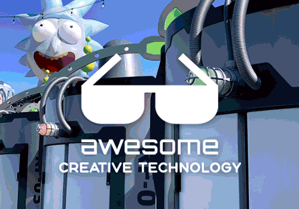

	

		
	

	 
	

		Curated list of Creative Technology groups, companies, studios, collectives, etc.
	

	 
	
	

# Awesome Creative Technology

> Businesses & groups that specialize in combining computing, design, art, and user experience.

Creative technology is a broadly interdisciplinary and transdisciplinary field combining computing, design, art, and user experience.

This list hopes to compile the best creative technology businesses & groups across the world, both as a source of inspiration and as a reference point for potential employers of creative technologists.

Creative technologists by definition have a breadth of skills as opposed to a specific specialty, so it's difficult to categorize them. While this isn't a perfect organization, each group below generally specializes in the area to which they've been assigned.

## Contents

- **[Creative Technology](#creative-technology)**
- **[Collectives & Practices](#collectives--practices)**
- **[Fabricators](#fabricators)**
- **[Themed Entertainment](#themed-entertainment)**
- **[Experiential Pop-Ups](#experiential-pop-ups)**
- **[Event Production](#event-production)**
- **[Architecture](#architecture)**
- **[Agencies](#agencies)**
- **[Museums](#museums)**
- **[Closed](#closed)**

## Creative Technology

| Name | Locations | Keywords |
|---|:---:|---|
| **[1024 Architecture](https://www.1024architecture.net/)** | \[Paris] | _architectural and digital works, orchestrated sound and light scores_ |
| **[Alt Ethos](https://altethos.com/)** | \[Denver] | _experiential, metaverse, and event design agency_ |
| **[Art + Com](https://artcom.de/en/)** | \[Berlin] | _media sculptures, data installations, new media_ |
| **[Augmented Magic](https://www.augmented-magic.com/)** | \[Paris] | _augmented magic shows, digital installations_ |
| **[AV Controls](https://www.av-controls.com/)** | \[NYC] | _site-specific technology installations, digital landmarks_ |
| **[Barbarian](https://wearebarbarian.com/)** | \[NYC] | _marketing and advertising, new media_ |
| **[Blackbow](https://www.blackbow.cn/)** | \[Beijing] | _projection mapping, digital art and cultural experiences_ |
| **[Blublu](http://www.blu-blu.com/)** | \[Hangzhou] | _projection mapping, immersive experiences for museums and workspace_ |
| **[Blue Cadet](https://www.bluecadet.com/)** | \[Philadelphia] \[NYC] | _experience design across digital and physical environments, visitor centers_ |
| **[BREAKFAST](https://breakfastny.com/)** | \[NYC] | _software-/hardware-driven artworks, flip discs_ |
| **[Breeze Creative](https://www.breezecreative.com/)** | \[NYC] \[Miami] | _interactive experience design, family entertainment, museums, playgrounds, educational institutions_ |
| **[BRDG Studios](https://www.brdg.co/)** | \[Philadelphia] | _digital moments in physical spaces, retail environments, art galleries, events_ |
| **[Burnlab](www.burncg.cn)** | \[Chengdu] | _kinetic installations for hotels and malls_ |
| **[C&G Partners](https://www.cgpartnersllc.com/)** | \[NYC] | _branding, digital installations, exhibits and environments, signage, wayfinding, websites_ |
| **[Cinimod Studio](https://www.cinimodstudio.com)** | \[London] | _location based work where technology, environment, content and real life interaction meet_ |
| **[Comuzi](https://www.comuzi.xyz/)** | \[London] | _explore and imagine and prototyp and creatr future-forward creative concepts_ |
| **[Deeplocal](https://www.deeplocal.com/)** | \[Pittsburgh] | _creative engineers, inventors, interactive experiences, human stories_ |
| **[Design I/O](https://www.design-io.com/)** | \[New York] \[Bay Area] | _immersive, interactive installations, storytelling, events, galleries, museums, exhibitions and public space_ |
| **[Dimensional Innovations](https://dimin.com/)** | \[Kansas City] \[Atlanta] \[Minneapolis] \[Denver] \[Los Angeles] \[Pittsburgh] | _experience design, interactive experiences, brand activation_ |
| **[Digifun](http://www.digitalfun.net/)** | \[Shanghai] | _projection mapping, new media art education_ |
| **[dotdotdash](https://dotdotdash.io/)** | \[Portland] \[LA] \[NYC] | _innovation agency that seamlessly blends the physical and digital_ |
| **[Downstream](https://downstream.com/)** | \[Portland] \[Amsterdam] \[Melbourne] | _strategy + design + content + technology_ |
| **[Envoy](https://www.weareenvoy.com/)** | \[Chicago] \[LA] \[San Diego] | _transform environments into exceptional experiences, formerly Leviathan_ |
| **[ESI Design](https://esidesign.nbbj.com/)** | \[NYC] | _transforms places into experiences, immersive deisgn, architectural scale_ |
| **[Extrapolation Factory](https://extrapolationfactory.com/)** | \[NYC] | _research studio, futures studies, collaborative prototyping_ |
| **[Fast Horse](https://www.fasthorseinc.com/)** | \[Minneapolis] | _a truly integrated creative agency_ |
| **[FIELD](https://www.field.io/)** | \[London] | _future aesthetics for design, motion, experiential_ |
| **[Float4](https://float4.com/en/)** | \[Montreal] \[NYC] | _integrates digital experiences into physical spaces to amplify their identity_ |
| **[fuse](https://www.fuseworks.it/en/)** | \[Modena, Italy] | _live-media performances, experimentation, electronic music, digital arts_ |
| **[Future Colossal](https://www.futurecolossal.com/)** | \[NYC] | _experiential technologies in advertising and entertainment and art_ |
| **[Gallagher Design](https://www.gallagherdesign.com/)** | \[DC] \[NYC] \[Portland] \[Singapore] | _harmony between technology, narrative, and physical design_ |
| **[Game Seven](https://www.gamesevenmktg.com/)** | \[NYC] \[LA] | _intersection of sport and culture, brand stories_ |
| **[Geeksart](http://geeks-art.com/)** | \[Guangzhou] \[Shanghai] | _media sculptures, new media exhibition_ |
| **[Giant Spoon](https://giantspoon.com/)** | \[NYC] \[LA] | _translate cultural trends into big ideas, experiential, gaming_ |
| **[Hotel Creative](https://hotelcreative.com/)** | \[London] | _retail, branding, exhibitions, events_ |
| **[Hovercraft](https://www.hovercraftstudio.com/)** | \[Denver] \[Portland] | _interactive installations, site-specific content, retail, sports_ |
| **[Hush Studios](https://heyhush.com/)** | \[NYC] | _marketing and advertising, retail and DTC, archtecture_ |
| **[Invisible North](https://www.invisiblenorth.com/)** | \[NYC] | _culturally fluent, thoughtful experiences, bring brands to life_ |
| **[Jam3](https://www.jam3.com)** | \[Toronto] \[LA] \[Montevideo] \[Amsterdam] | _create modern experiences for tomorrow’s brands_ |
| **[Listen](https://wearelisten.com/)** | \[NYC] | _sensory-driven brand assets, modern cultural landscape, sound, experiences_ |
| **[Lorem Ipsum](https://loremipsumcorp.com/)** | \[NYC] \[Moscow] \[London] | _experience design, narrative, physical and digital environments_ |
| **[Manifold](https://www.wearemanifold.com/)** | \[San Francisco] \[LA] \[Portland] | _we hire smart people and get out of their way_ |
| **[Map](http://mapprojectoffice.com/)** | \[London] | _industrial designers who believe great design can solve problems_ |
| **[Marshmallow Laser Feast](https://www.marshmallowlaserfeast.com/)** | \[London] | _leaving a slug trail of sensory nuggets as we journey through the cosmos_ |
| **[Midnight Commercial](http://midnightcommercial.com/)** | \[NYC] | _unite the disparate digital and physical worlds_ |
| **[MindBuffer](https://mindbuffer.net/)** | \[Berlin] | _audiovisual research and digital design studio_ |
| **[Moment Factory](https://momentfactory.com/home)** | \[Montreal] \[LA] \[London] \[Tokyo] \[Paris] \[NYC] | _shows, destinations, content, interactive, scenography_ |
| **[Motse](https://www.behance.net/motseart/projects)** | \[Shenzhen] | _digital art_ |
| **[NeoPangea](https://www.neopangea.com/)** | \[West Reading, Pennsylvania] | _microsites, games, VR/AR, digital, social_ |
| **[NGX Interactive](https://ngxinteractive.com/)** | \[Vancouver] | _pushing new technologies to create experiences that are vivid and meaningful_ |
| **[Night Kitchen](https://www.whatscookin.com/)** | \[Philadelphia] | _dynamic digital experiences, online exhibitions, digital strategy, storytelling_ |
| **[Nowhere](https://studionowhere.com/)** | \[Shanghai] | _marketing events, interactive experiences_ |
| **[Oat Foundry](https://www.oatfoundry.com/)** | \[Philadelphia] | _split-flap displays, electromechanical stuff, think tank, products, experiences_ |
| **[Onformative](https://onformative.com/)** | \[Berlin] | _studio for digital art and design, challenge the boundaries between art and design and technology_ |
| **[Optimist](https://optimistinc.com/)** | \[LA] \[NYC] \[London] \[Amsterdam] \[Hamburg] \[Berlin] \[Prague] | _architects of subculture, creative, design, strategy, production, content, brand experience_ |
| **[Patten Studio](https://www.pattenstudio.com/)** | \[NYC] | _informed by research at the MIT Media Lab, experiences that connect people_ |
| **[Potion Design](https://www.potiondesign.com/)** | \[NYC] | _design and technology studio, interactive, musuems_ |
| **[pretty bloody simple](https://www.prettybloodysimple.com)** | \[Munich] | _interactive experiences, analog and digital, musuems_ |
| **[Rare Volume](https://rarevolume.com/)** | \[NYC] | _design and technology studio, interactive video walls_ |
| **[Red Paper Heart](https://redpaperheart.com)** | \[NYC] | _art from real world interaction_ |
| **[Relative Scale](https://relativescale.com/)** | \[Raleigh] | _bespoke digital products and experiences for brands and institutions_ |
| **[The Lab at Rockwell Group](https://www.labatrockwellgroup.com)** | \[NYC] | _architecture and design, branded experiences, immersive environments, pop ups_ |
| **[Rosie Lee Creative](https://rosieleecreative.com/)** | \[London] \[Amsterdam] \[NYC] | _design, creative, digital and consultancy_ |
| **[Second Story](https://secondstory.com/)** | \[Atlanta] \[Portland] \[NYC] | _exhibition, interactive, software, experience, hardware, VR, AR, projection_ |
| **[Seeeklab](https://www.seeeklab.com/en/)** | \[Xiamen] | _marketing events, interactive installation_ |
| **[space150](https://www.space150.com/)** | \[Minneapolis] \[LA] \[NYC] | _a tech-driven creative agency_ |
| **[Staat](https://www.staat.com/)** | \[Amsterdam] | _branding, editorial, event, film, graphic design, illustration, installation, interactive, interior design, production, retail_ |
| **[Stimulant](https://stimulant.com/)** | \[San Francisco] | _experience design and interactive installation, human-scale, site-specific digital experiences and touchscreen applications_ |
| **[StoreyStudio](https://www.storeystudio.com/)** | \[London] | _spatial design, set design, window displays, moving image_ |
| **[Studio Black](https://www.studioblack.org/)** | \[LA] \[NYC] | _technical production, design advisory, content management, digital content_ |
| **[Team Epiphany](https://www.teamepiphany.com/)** | \[NYC] \[LA] | _influencer marketing, IRL, vertical integration_ |
| **[Tellart](https://www.tellart.com/)** | \[Providence] \[Amsterdam] \[San Francisco] | _transformative experiences, invention, physical & digital experiences, new technologies_ |
| **[The Gathery](http://www.thegathery.com/)** | \[NYC] | _editorially-born creative agency specializing in brand marketing and content creation_ |
| **[The Projects](http://theprojects.com/)** | \[London] \[LA] \[NYC] \[Sydney] | _brand consultancy, meaningful experiences, tell stories_ |
| **[Two Goats](https://www.twogoats.us/)** | \[NYC] \[LA] \[London] | _AR, interactive branded experiences_ |
| **[Trivium Interactive](https://www.triviuminteractive.com/)** | \[Boston] | _experience design and production_ |
| **[UNIT9](https://www.unit9.com/)** | \[London] \[LA] \[NYC] \[Berlin] | _innovation architects, product designers, software engineers, gaming experts, creatives, art directors, designers, producers and film directors_ |
| **[Unified Field](https://www.unifiedfield.com/)** | \[NYC] | _content-rich, experiential and interactive media for digital branding, media environments, and exhibits in public spaces_ |
| **[Upswell](https://hello-upswell.com/)** | \[Portland] | _digital and physical content first experiences_ |
| **[VTProDesign](https://vtprodesign.com/)** | \[LA] | _high tech robotics and projection mapping_ |
| **[VVOX](https://volvoxlabs.com/)** | \[NYC] \[LA] | _high-end design, code, fabrication, sound_ |
| **[Wonderlabs](https://www.wonderlabsstudio.com/)** | \[Shanghai] | _marketing events, interactive installation_ |
| **[XORXOR](https://www.xorxor.hu)** | \[Budapest] | _collaboration between scientists, engineers, artists and robots, real-time visuals meet complex design_ |
| **[Yellow Studio](https://yellowstudio.com/)** | \[NYC] | _artistically-minded design, tv/concert/event production design, set design_ |

## Collectives & Practices

Established artist collectives/practices that work with creative technology (here primarily for reference, not for career opportunities).

| Name | Locations | Keywords |
|---|:---:|---|
| **[Cuttefish](https://www.thecuttlefish.com/)** | \[United States] | _explore and imagine and prototyp and creatr future-forward creative concepts_ |
| **[Dave + Gabe](https://www.daveandgabe.care/)** | \[NYC] | _interactive installation studio, real-time animation, generative 3D sound_ |
| **[MSCHF](https://mschf.xyz/)** | \[NYC] | _viral stunts and products, trying to do stuff that the world can't even define_ |
| **[NONOTAK Studio](https://www.nonotak.com/)** | \[Paris] | _light and sound installations, ethereal, immersive, dreamlike_ |
| **[panGenerator](https://pangenerator.com/)** | \[Warsaw, Poland] | _new media art and design collective, mixing bits & atoms_ |
| **[Random International](https://www.random-international.com/)** | \[London] \[Berlin] | _experimental practice within contemporary art, human condition in an increasingly mechanised world_ |
| **[Smooth Technology](https://smooth.technology/)** | \[NYC] | _cutting-edge technology and artistic sensibility, wireless wearables, create the impossible_ |
| **[teamLab](https://www.teamlab.art/)** | \[Tokyo] | _full-room interactive projection mapping, interdisciplinary group of ultratechnologists_ |
| **[United Visual Artists](https://www.uva.co.uk/)** | \[London] | _new technologies with traditional media, site-specific, instruments that manipulate perception_ |
| **[WHYIXD](https://www.whyixd.com/)** | \[Taiwan] | _cross-disciplinary art installations, dance, architecture, music_ |
| **[Zebradog](https://www.zebradog.com/)** | \[Madison] | _communication design and the built environment, higher education_ |

## Fabricators

Groups that mostly fabricate pieces for other creative technology companies.

| Name | Locations | Keywords |
|---|:---:|---|
| **[Bednark](https://builtbybednark.com/)** | \[NYC] | _full-service fabrication, production, install_ |
| **[Pink Sparrow](https://www.pinksparrow.com/)** | \[NYC] \[LA] | _environmental design, project management_ |
| **[Visionary Effects](http://www.visionaryeffects.com/)** | \[Pittsburgh] | _old-school manufacturing processes with digital design and fabrication_ |

## Themed Entertainment

Groups that design things for stage and amusement parks using creative technology.

| Name | Locations | Keywords |
|---|:---:|---|
| **[Adirondack Studios](https://www.adkstudios.com/)** | \[Glens Falls, NY] \[Dubai] \[Orlando] \[Shanghai] \[LA] \[Singapore] | _concept, schematic, design, construction, fabrication, installation, support_ |
| **[Charcoalblue](https://www.charcoalblue.com/)** | \[NYC] \[Melbourne] \[Chicago] \[UK] \[London] | _amazing spaces where stories are told and experiences are shared_ |
| **[Hettema Group](https://thehettemagroup.com/)** | \[LA] | _experiential, exhibit, live shows, theme parks, retail, dining, museums_ |
| **[Jason Sherwood Design](https://jasonsherwooddesign.com/)** | \[NYC] | _television and broadway and concert stage design_ |

## Experiential Pop-Ups

Groups that create experential pop-up experiences full of creative technology.

| Name | Locations | Keywords |
|---|:---:|---|
| **[29 Rooms](https://www.29rooms.com/)** | - | _multi-sensory installations, performances, and workshops_ |
| **[Color Factory](https://www.colorfactory.co/)** | \[NYC] \[Houston] | _collaborative interactive exhibit_ |
| **[Meow Wolf](https://meowwolf.com/)** | \[Santa Fe] | _immersive and interactive experiences that transport audiences of all ages into fantastic realms of story and exploration_ |
| **[Museum of Ice Cream](https://www.museumoficecream.com/)** | \[San Francisco] \[NYC] | _transforms concepts and dreams into spaces that provoke imagination and creativity_ |
| **[PopUpMob](https://popupmob.com/)** | \[NYC] \[LA] \[London] \[Paris] | _one-stop shop for pop up experiences_ |

## Event Production

Groups that specialize in event production, often with a creative technology twist.

| Name | Locations | Keywords |
|---|:---:|---|
| **[Dera Lee Productions](http://www.deralee.com/)** | \[NYC] | theatre arts, story-telling |
| **[GPJ](https://www.gpj.com/)** | \[Austin] \[Boston] \[Dallas] \[Detroit] \[LA] \[Nashville] \[NYC] \[San Francisco] \[Silicon Valley] | _immersive events and experiences_ |
| **[Sparks](https://wearesparks.com/)** | \[Philadelphia] \[Detroit] \[Connecticut] \[Atlanta] \[LA] \[Las Vegas] \[NYC] \[San Francisco] \[Shanghai] | _trade show, experiential, retail_ |

## Architecture

Groups that generally design architecture with a leaning toward creative technology.

| Name | Locations | Keywords |
|---|:---:|---|
| **[Carlo Ratti Associatti](https://carloratti.com/)** | \[Torino, Italy] \[NYC] \[UK] | _design and innovation office, MIT Media Lab: Senseable City Lab_ |
| **[Gensler](https://dxd.gensler.com/)** | \[Worldwide] | _built environment with integrated capabilities in strategy, design, technology, data, and architecture_ |
| **[Olson Kundig](https://olsonkundig.com/)** | \[Seattle] \[NYC] | _architecture, vessel that supports specific art installations, seamless spatial experience_ |
| **[SOFTlab](https://softlabnyc.com/)** | \[NYC] | _mixes research and creativity and technology with a strong desire to make working fun_ |
| **[Universal Design Studio](http://www.universaldesignstudio.com/)** | \[London] \[NYC] | _driven by a deeply held belief in the transformative power of well designed and finely crafted spaces_ |

## Agencies

Groups that are have a more general focus, but have a knack for projects imbued with creative technology.

| Name | Locations | Keywords |
|---|:---:|---|
| **[&Walsh](https://andwalsh.com/)** | \[NYC] | _brand strategy, art direction, design and production across all platforms_ |
| **[Framestore](https://www.framestore.com/?language=en)** | \[London] \[NYC] \[Montreal] | _virtual, augmented and mixed realities, location-based entertainment, and theme park rides_ |
| **[ManvsMachine](https://mvsm.com/)** | \[London] \[LA] | _multidimensional creative studio_ |
| **[Media Monks](https://www.mediamonks.com/)** | \[Amsterdam] \[London] \[Dubai] \[Stockholm] \[NYC] \[LA] \[San Francisco] \[Mexico City] \[São Paulo] \[Buenos Aires] \[Shanghai] \[Singapore] | _creative production_ |
| **[R/GA](https://www.rga.com/)** | \[Austin] \[Chicago] \[LA] \[NYC] \[Portland] \[San Francisco] \[Berlin] \[Bucharest] \[London] \[Buenos Aires] \[Santiago] \[São Paulo] \[Melbourne] \[Shanghai] \[Singapore] \[Sydney] \[Tokyo] | _business, experience, and marketing transformation_ |
| **[The Mill](https://www.themill.com/)** | \[London] \[NYC] \[LA] \[Chicago] \[Bangalore] \[Berlin] | _experience makers, media and brand activation, innovative design, and inventive technologies_ |

## Museums

Groups that generally focus on designing museums and similar experiences using creative technology.

| Name | Locations | Keywords |
|---|:---:|---|
| **[Art Processors](https://www.artprocessors.net/)** | \[Melbourne] | _specialist interactive media and exhibition design_ |
| **[Exploratorium](https://www.exploratorium.edu/)** | \[San Francisco] | _exhibits made in-house, public-facing workshop_ |
| **[GSM Project](https://gsmproject.com/en/)** | \[Montreal] \[Singapore] \[Dubai] | _content first, exhibitions_ |
| **[Ideum](https://www.ideum.com/)** | \[Albuquerque] | _interactive exhibits and exhibitions, integrated hardware products_ |
| **[Iglhaut + von Grote](http://iglhaut-vongrote.de/en/)** | \[Berlin] | _scenography, spatial mise-en-scène_ |
| **[Local Projects](https://localprojects.com/)** | \[NYC] | _experience Designers pushing the boundaries of human interaction_ |
| **[Monadnock Media](https://monadnock.org/)** | \[Massachusetts] | _multimedia experiences for museums, historic sites and public places_ |
| **[Roto](https://roto.com/)** | \[Columbus] | _experience design, immersive media, interactive engineering, and custom fabrication for museums, brands, attractions and architectural placemaking._ |

## Closed

Groups that have closed their doors are still useful for reference and inspiration. Check out the list of them [here](closed.md).
